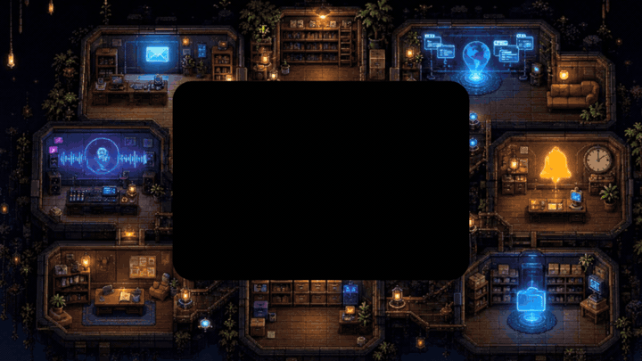

<div align="center">

# 🌌 Super Nova

### Your AI Companion — controlled entirely by voice.

*No keyboard. No clicks. Just talk.*

[](https://voice-companion-rust.vercel.app)
[](https://youtu.be/LCzO5H1y5q8)
[](https://elevenlabs.io)
[](https://cursor.com)



</div>

---

## ✨ What is Super Nova?

**Super Nova** is a voice-first AI companion. You wake it with a tap on the orb, and from that moment forward the entire interface is summoned by your voice — weather, music, maps, NASA photos, YouTube clips, Wikipedia summaries, timers, web searches, and more — all rendered as **living widgets** inside an animated colony environment where a small pet character walks between rooms as the conversation moves.

Built end-to-end in [Cursor](https://cursor.com) and powered by [ElevenLabs](https://elevenlabs.io) for **#ElevenHacks**.

> **The thesis:** chat is still typing into a smaller box. Voice + streaming TTS is the first interface that actually feels post-keyboard.

---

## 🎬 Demo

📺 **Watch the demo:** [youtu.be/LCzO5H1y5q8](https://youtu.be/LCzO5H1y5q8)
🌐 **Try it live:** [voice-companion-rust.vercel.app](https://voice-companion-rust.vercel.app)
*(Chrome required — the Web Speech API is Chromium-only. Allow mic access on first load.)*

Try saying:

| Say this… | …and Super Nova does this |
|---|---|
| *"Hey Vee, what's the weather in Tokyo?"* | Live weather widget materializes |
| *"Play some lofi"* | Music player + 96px frequency visualizer + autoplay |
| *"Show me directions to Times Square"* | Real OSM map renders with the OSRM route |
| *"Today's NASA picture"* | Astronomy Photo of the Day widget |
| *"Search YouTube for Three.js shaders"* | Embedded video result |
| *"Summarize the Wikipedia article on Mars"* | Compact knowledge card |
| *"Set a timer for 10 minutes"* | Animated countdown |
| *"Browse hackernews"* | Live news feed |

---

## 🧠 How It Works

```
   ┌──────────────┐    ┌──────────┐    ┌──────────────┐    ┌─────────────┐
   │ Web Speech   │───▶│  Groq    │───▶│  Intent      │───▶│  API route  │
   │ API (Chrome) │    │  LLM     │    │  Classifier  │    │  or MCP     │
   └──────────────┘    └──────────┘    └──────────────┘    └──────┬──────┘
                                                                  │
        ┌─────────────────────────────────────────────────────────┘
        ▼
   ┌──────────────┐    ┌──────────────────┐    ┌─────────────────┐
   │   Widget     │    │   ElevenLabs     │    │  Colony pet     │
   │   renders    │    │   Turbo v2.5     │    │  walks to room  │
   │              │    │   streams TTS    │    │                 │
   └──────────────┘    └──────────────────┘    └─────────────────┘
```

1. **Listen** — Web Speech API captures your speech in real time. A live FFT visualizer reflects your mic input.
2. **Understand** — Groq runs intent classification in ~200 ms, picking from a typed catalogue of skills (`lib/environment-intents.ts`).
3. **Route** — Each intent either hits an internal `/api/*` route or a remote **MCP server** (music + YouTube ship preconfigured).
4. **Render + Speak** — A typed widget animates onto screen while ElevenLabs streams the spoken reply. The colony pet walks toward the room that matches the intent.

End-to-end loop closes in under a second on a warm cache.

---

## 🛠 Tech Stack

| Layer | Tool |
|---|---|
| Framework | **Next.js 15** (App Router, API routes) |
| UI | **React 19** + **TypeScript** + **Tailwind CSS** |
| State | **Zustand** |
| Motion | **Framer Motion** |
| 3D / colony | **Three.js** + **@react-three/fiber** + **@react-three/drei** |
| Speech-to-text | **Web Speech API** (browser-native, zero cost) |
| Text-to-speech | **ElevenLabs Turbo v2.5** (streaming) |
| LLM | **Groq** (Llama-3.x for intent + summarization) |
| Tools | **MCP** (Model Context Protocol) — pluggable remote tool servers |
| Maps | **OpenStreetMap** + **OSRM** (no API key) |
| Astronomy | **NASA APOD** |
| Web browsing *(optional)* | **Firecrawl** |
| IDE | **Cursor** |

---

## 🚀 Getting Started

### Prerequisites

- **Node.js 18+**
- **Chrome** (required — Web Speech API is Chromium-only)
- **Groq API key** ([console.groq.com](https://console.groq.com) — free tier works)
- **ElevenLabs API key** ([elevenlabs.io](https://elevenlabs.io) — free tier: 10k chars/month)

### 1 · Clone & install

```bash
git clone https://github.com/anirxdh/Voice-companion.git
cd Voice-companion
npm install
```

### 2 · Configure environment

```bash
cp .env.example .env
```

Then fill in:

```env
# Required
GROQ_API_KEY=                        # https://console.groq.com
ELEVENLABS_API_KEY=                  # https://elevenlabs.io
NEXT_PUBLIC_ELEVENLABS_VOICE_ID=     # any voice ID from your ElevenLabs library

# MCP endpoints — music + YouTube ship preconfigured, change if you self-host
NEXT_PUBLIC_MCP_ENDPOINT_YOUTUBE_VIDEO=https://still-thunder-8btdl.run.mcp-use.com/mcp
NEXT_PUBLIC_MCP_ENDPOINT_MUSIC=https://young-surf-xt5j8.run.mcp-use.com/mcp

# Optional
FIRECRAWL_API_KEY=                   # enables richer "browse / scout" answers
NEXT_PUBLIC_COLONY_PET_THEME=        # blank = office sprites, or "onepiece" for crew sprites
```

### 3 · Run

```bash
npm run dev
```

Open **[http://localhost:3000](http://localhost:3000)** in **Chrome**, click the orb, and start talking.

### Other scripts

```bash
npm run build      # production build
npm run start      # serve the production build
npm run typecheck  # tsc --noEmit
npm run lint       # next lint
npm run clean      # nuke .next
```

---

## 🎙 Voice Commands Reference

Super Nova classifies intents into the following families (see `lib/environment-intents.ts`):

| Family | Example commands | Backed by |
|---|---|---|
| **Weather** | *"weather in Lisbon"*, *"is it raining in NYC?"* | `app/api/weather` |
| **Maps & directions** | *"directions to LAX"*, *"map of Paris"* | `app/api/directions`, `app/api/maps` |
| **Music** | *"play lofi"*, *"play Daft Punk"* | MCP music server |
| **YouTube** | *"search YouTube for shaders"*, *"play that Three.js talk"* | MCP YouTube server |
| **News / browse** | *"hackernews today"*, *"browse The Verge"* | `app/api/news`, `app/api/browse` |
| **NASA / orbit** | *"today's NASA picture"*, *"what's in orbit?"* | `app/api/orbit` |
| **Scout / Q&A** | *"who built the Eiffel Tower?"*, *"summarize quantum entanglement"* | `app/api/scout` + Groq |
| **Timers** | *"timer 10 minutes"*, *"set a 30 second timer"* | Local widget |
| **Conversation** | *"what did we just talk about?"*, *"clear the screen"* | `app/api/conversation` |

---

## 🌟 Features

- 🎙 **Real-time mic visualizer** — true FFT data from your microphone while listening; automatically switches to the music analyser during playback.
- 🎵 **Built-in music player** — album art, 96-bar frequency visualizer, autoplay after TTS, queue control by voice.
- 🐾 **Colony environment** — an animated pet character walks between rooms (music, maps, news, weather…) as your conversation moves.
- 🪟 **Multi-widget stacking** — weather + directions + timer + music can all live on screen simultaneously without overlap.
- 🔌 **MCP-native** — plug any MCP-compatible server in via env var; the orchestrator routes to it automatically.
- 🎭 **Theme packs** — set `NEXT_PUBLIC_COLONY_PET_THEME=onepiece` to swap office sprites for a Straw Hat crew.
- ⚡ **Streaming TTS** — ElevenLabs Turbo v2.5 means Vee starts speaking before the full reply is generated.

---

## 📁 Project Structure

```
voice-companion/
├── app/
│   ├── api/                       # Server-side routes
│   │   ├── browse/                # Firecrawl-powered web browsing
│   │   ├── colony-notes/          # Per-room note store
│   │   ├── conversation/          # Chat history / clear
│   │   ├── directions/            # OSRM directions
│   │   ├── elevenlabs/            # TTS proxy
│   │   ├── groq/                  # LLM proxy
│   │   ├── maps/                  # OSM tiles / geocoding
│   │   ├── news/                  # News feed
│   │   ├── orbit/                 # NASA APOD + space data
│   │   ├── scout/                 # General Q&A + summarization
│   │   └── weather/               # Open-Meteo weather
│   └── page.tsx                   # Shell — mounts SuperNovaApp
├── components/
│   ├── colony/                    # Animated pet + room glow
│   ├── environment/               # Background, rooms, depth layers
│   ├── hud/                       # Voice HUD overlay (transcript, status)
│   ├── orb/                       # Central wake orb
│   ├── pets/                      # Crowd sprite sync + crew deck
│   ├── voice/                     # Mic visualizer, listening state
│   └── supernova-app.tsx          # Top-level composition
├── lib/
│   ├── elevenlabs.ts              # Streaming TTS client
│   ├── environment-intents.ts     # Intent catalogue + classifier
│   ├── groq.ts                    # Groq LLM wrapper
│   ├── intent.ts                  # Intent → route mapping
│   ├── mcp-client.ts              # MCP transport
│   ├── mic-analyser.ts            # Real-time mic FFT
│   ├── music-player.ts            # Audio + analyser
│   └── perception-layer.ts        # Multimodal context fusion
├── hooks/
│   ├── use-voice.ts               # Web Speech API wrapper
│   └── use-orchestration.ts       # Intent → tool routing hook
└── public/
    ├── assets/pets/               # Sprite sheets (office + onepiece)
    └── backgrounds/               # Animated environment art
```

---

## 🧪 Performance Notes

- **Cold start** ~600 ms (Next.js edge runtime warming + first ElevenLabs call).
- **Warm intent → audio** ~700 ms total (Groq ~200 ms + tool ~100–300 ms + ElevenLabs first byte ~200 ms).
- **Mic visualizer** runs at 60 fps off a single `AnalyserNode` — no per-frame allocations.
- **Streaming TTS** starts playback at the first audio chunk, not the last token — perceived latency is much lower than the numbers suggest.

---

## 🗺 Roadmap

- [ ] Wake-word detection (currently tap-to-wake the orb)
- [ ] On-device STT fallback for Safari / Firefox
- [ ] Persistent conversation memory across reloads
- [ ] User-installable MCP tool marketplace inside the app
- [ ] Multi-user "rooms" — one colony, multiple voices

---

## 🙏 Credits

- **[Cursor](https://cursor.com)** — the AI-first IDE this was built in
- **[ElevenLabs](https://elevenlabs.io)** — Turbo v2.5 streaming TTS
- **[Groq](https://groq.com)** — sub-second LLM inference
- **[OpenStreetMap](https://openstreetmap.org)** + **[OSRM](https://project-osrm.org)** — maps without API keys
- **[NASA APOD](https://apod.nasa.gov)** — astronomy photos
- **[mcp-use](https://mcp-use.com)** — hosted MCP servers

Built by **[@anirxdh](https://github.com/anirxdh)** for **[#ElevenHacks](https://elevenlabs.io)** • 7 days • caffeine + Cursor.

---

<div align="center">

**[📺 Watch the demo](https://youtu.be/LCzO5H1y5q8)** &nbsp;•&nbsp; **[🌐 Try it live](https://voice-companion-rust.vercel.app)**

*Tag [@cursor](https://x.com/cursor_ai) and [@elevenlabsio](https://x.com/elevenlabsio) if you build something with it.*

</div>
